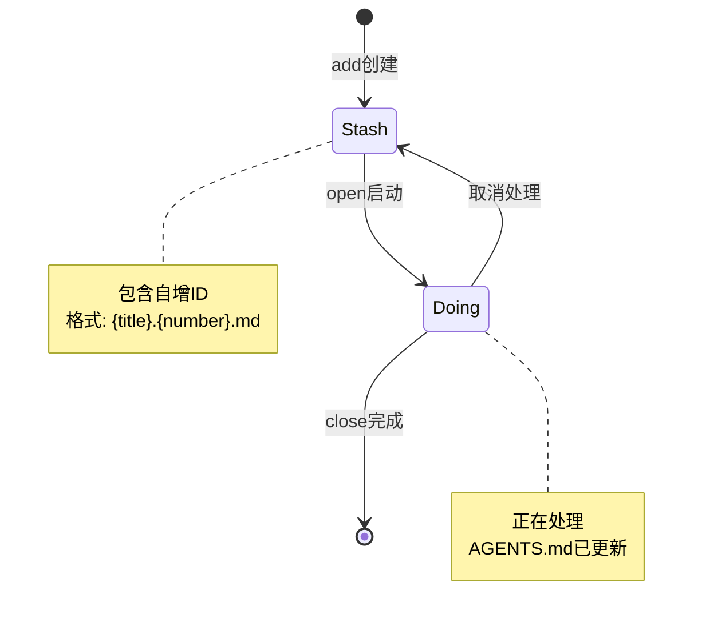

# Issue-Make 需求分析与实现文档

## 📋 项目概述

### 项目背景
`issue-make` 是一个面向开发者的轻量级issue管理工具，旨在解决本地临时存储和管理bug、feature等开发任务的需求。

### 核心价值
- **本地优先**：无需依赖外部服务，快速记录开发想法
- **AI增强**：集成OpenAI SDK，智能生成issue标题
- **多模态交互**：支持TUI全屏界面和CLI命令行
- **Agent协作**：与AGENTS.md集成，支持人机协作开发

## 🎯 功能需求分析

### 1. TUI交互模式
**功能描述**：全屏终端UI界面，支持slash命令交互

**核心功能**：
- 启动`issue-make`进入全屏TUI模式
- 支持`/add:${type}`slash命令（slash指斜杠命令语法），type可选：feat|todo|bug|refact
- 输入描述内容后自动生成issue文件到`.issues/stash/`目录
- AI自动生成标题（基于配置）

**注意**：slash命令只是交互语法，底层创建的issue文件统一存放在`.issues/stash/`目录

### 2. CLI命令模式
**功能描述**：命令行工具，支持完整的issue生命周期管理

**核心命令**：
```bash
# 初始化配置
issue-make init

# 添加issue（CLI模式）
issue-make add --type feat path/to/description.md

# 开始处理issue
issue-make open [title|number]

# 完成issue
issue-make close [title|number]
```

### 3. AI集成服务
**功能描述**：配置OpenAI SDK，支持多种AI服务商

**配置信息**：
- 全局配置文件：`~/.issue-make/settings.json`
- 配置项：url、api、model
- 功能：基于描述内容生成issue标题

### 4. 文件管理系统
**功能描述**：issue状态流转和文件管理

**目录结构**：
```
.issues/
├── stash/     # 待处理issue（包含自增ID）
├── doing/     # 正在处理的issue
├── achieved/  # 已完成的issue（去除ID）
└── solution.md  # 解决方案文件（open时创建，close时合并）
```

**文件命名规则**：
- stash: `{title}.{number}.md`
- doing: `{title}.{number}.md`
- achieved: `{title}.md`

**issue文件格式**：
```markdown
---
Create Date: YYYY-MM-DD
Type: [feat|todo|bug|refact]
---
${添加上的原文}
```

### 5. Agent协作集成
**功能描述**：与AGENTS.md文件集成，支持人机协作

**工作流程**：
1. `open`命令时自动更新AGENTS.md
2. 添加任务描述和解决方案模板
3. `close`命令时清理AGENTS.md内容
4. 合并`.issues/solution.md`到最终文件

**AGENTS.md标记符格式**：
```html
<!-- ISSUE-MAKE:START -->
[任务描述和解决方案模板]
<!-- ISSUE-MAKE:END -->
```

## 🏗️ 技术架构设计

### 技术栈选型
```json
{
  "core": {
    "language": "TypeScript",
    "runtime": "Node.js",
    "package_manager": "pnpm"
  },
  "ui": {
    "tui_framework": "ink (React for CLI)",
    "cli_framework": "Commander.js"
  },
  "ai": {
    "sdk": "openai",
    "providers": ["OpenAI", "Deepseek", "其他兼容服务商"]
  },
  "file_system": {
    "path": "Node.js path模块",
    "fs": "Node.js fs/promises"
  },
  "config": {
    "global_config": "~/.issue-make/settings.json",
    "format": "JSON"
  }
}
```

### 核心模块设计

#### 1. Config管理模块
```typescript
interface Settings {
  url: string;
  api: string;
  model: string;
}

class ConfigManager {
  getConfig(): Promise<Settings>
  setConfig(settings: Settings): Promise<void>
  ensureConfigDir(): Promise<void>
}
```

#### 2. AI服务模块
```typescript
class AIService {
  constructor(private config: Settings)
  
  generateTitle(description: string): Promise<string>
  validateConfig(): Promise<boolean>
}
```

#### 3. 文件管理模块
```typescript
interface IssueFile {
  title: string;
  number: number;
  type: 'feat' | 'todo' | 'bug' | 'refact';
  content: string;
  createDate: Date;
}

class FileManager {
  createIssue(issue: IssueFile): Promise<void>
  findIssue(identifier: string): Promise<IssueFile | null>
  moveToDoing(issue: IssueFile): Promise<void>
  moveToAchieved(issue: IssueFile): Promise<void>
  getNextId(): Promise<number>
}
```

#### 4. TUI模块
```typescript
class TUIApp {
  start(): Promise<void>
  handleSlashCommand(command: string): Promise<void>
  render(): void
}
```

#### 5. CLI模块
```typescript
class CLI {
  init(): Promise<void>
  add(type: string, filePath: string): Promise<void>
  open(identifier: string): Promise<void>
  close(identifier: string): Promise<void>
}
```

## 📊 数据流程图

```mermaid
graph TD
    A[用户输入] --> B{交互模式}
    B -->|TUI| C[Slash命令解析]
    B -->|CLI| D[命令行解析]
    
    C --> E[/add:${type}]
    D --> F[add --type]
    
    E --> G[AI标题生成]
    F --> H[文件读取]
    
    G --> I[创建stash文件]
    H --> I
    
    I --> J[open命令]
    J --> K[移动到doing目录]
    K --> L[更新AGENTS.md]
    
    L --> M[Agent工作]
    M --> N[close命令]
    N --> O[清理AGENTS.md]
    O --> P[移动到achieved]
    P --> Q[合并solution]
```

## 📁 项目结构设计

```
issue-make/
├── src/
│   ├── cli/
│   │   ├── commands/
│   │   │   ├── init.ts
│   │   │   ├── add.ts
│   │   │   ├── open.ts
│   │   │   └── close.ts
│   │   └── index.ts
│   ├── tui/
│   │   ├── app.ts
│   │   ├── components/
│   │   └── handlers/
│   ├── core/
│   │   ├── config.ts
│   │   ├── ai.ts
│   │   ├── file-manager.ts
│   │   └── types.ts
│   ├── utils/
│   │   ├── path.ts
│   │   ├── date.ts
│   │   └── validation.ts
│   └── index.ts
├── bin/
│   └── issue-make
├── templates/
│   ├── issue-template.md
│   └── agents-template.md
├── tests/
│   ├── unit/
│   └── integration/
├── package.json
├── tsconfig.json
├── README.md
└── CHANGELOG.md
```

## 🔄 Issue生命周期



## 🎯 关键实现细节

### 自增ID管理
- 基于文件系统实现，避免并发冲突
- 每次创建时扫描stash目录最大ID
- ID从0开始，全局唯一

### 文件搜索逻辑
- `open [identifier]`只接受单个参数
- 优先按数字匹配，再按标题模糊匹配
- 支持部分标题匹配

### AGENTS.md集成
- 使用XML注释标记作为插入点：`<!-- ISSUE-MAKE:START -->` 和 `<!-- ISSUE-MAKE:END -->`
- 支持多次open/close操作
- 自动清理过时内容
- open时创建`.issues/solution.md`文件
- close时合并`.issues/solution.md`内容到归档文件

### 错误处理
- AI服务不可用时的降级方案
- 文件操作异常的友好提示
- 配置缺失的引导流程
- **重复open处理**：如果尝试open已经在doing目录的issue，报错提示
- **缺少solution处理**：close时如果`.issues/solution.md`不存在，报错提示用户让agent创建

## 📋 需求确认清单

在开始实现前，请确认以下需求点：

- [x] TUI使用ink (React for CLI) 全屏界面
- [x] AI配置支持所有OpenAI兼容服务商
- [x] Issue编号从0开始自增
- [x] open命令只接受单个参数
- [x] AGENTS.md格式使用XML注释标记
- [x] 暂不支持多Agent并行
- [x] slash命令只是交互语法，文件统一存放在stash/
- [x] solution.md路径为`.issues/solution.md`
- [x] 日期格式为YYYY-MM-DD
- [x] 重复open同一issue时报错
- [x] close时缺少solution.md时报错

## 🚀 实现优先级

### Phase 1: 核心基础（MVP）
1. 配置管理系统
2. 基础文件操作
3. CLI add命令
4. 简单的open/close流程

### Phase 2: AI集成
1. OpenAI SDK集成
2. 标题生成功能
3. 配置验证

### Phase 3: TUI界面
1. ink (React for CLI) 集成
2. Slash命令处理
3. 全屏交互体验

### Phase 4: 完善功能
1. 错误处理优化
2. 单元测试覆盖
3. 文档完善